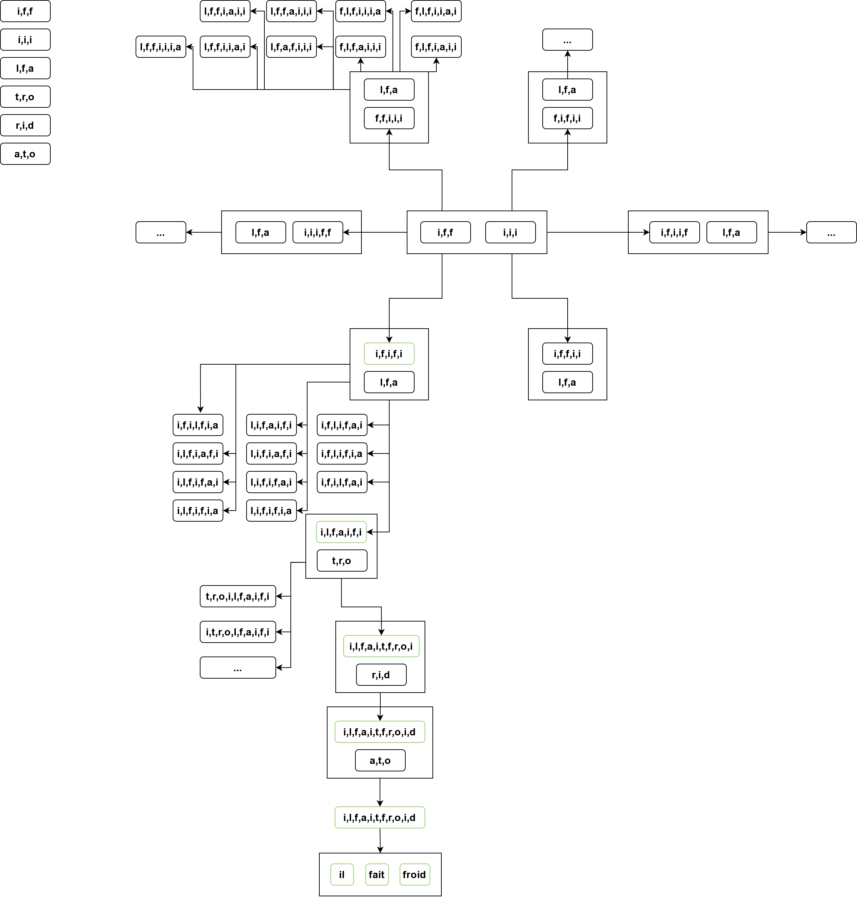

### RecoverSecret : le challenge de décodage

L'objectif est de retrouver la phrase d'origine à partir d'un ensemble de n-[uplet]
s(https://fr.wikipedia.org/wiki/Uplet) composés de lettres prises dans l'ordre d'apparition de la phrase mystère.

Par exemple la phrase: ```il fait froid``` peut être associée aux n-uplets suivants:

| n-uplet |
|---------|
| i,f,f   |
| i,i,i   |
| l,f,a   |
| t,r,o   |
| r,i,d   |
| a,t,o   |
| ...     |

## Structures de données en entrée / sortie pour

```rust
pub struct RecoverSecretInput {
    pub letters: String,
    pub tuple_sizes: Vec<usize>,
}

pub struct RecoverSecretOutput {
    pub secret_sentence: String,
}
```

Les données d'entrée présentent une forme de compression parfois appelé CSR (Compressed Sparce Row).

|                                            caractères                                            | a   | b   | c   | d   | e   | a   | c   | b   | d   |
|:------------------------------------------------------------------------------------------------:|-----|-----|-----|-----|-----|-----|-----|-----|-----|
|                                           tuple_sizes                                            | 3   |     |     | 2   |     | 4   |     |     |     |
| associated tuple   <td colspan=3> a,b,c</td> <td colspan=2> d,e</td> <td colspan=4> a,c,b,d</td> |

## Remarques pas tout à fait inutiles

* Tous les mots viennent de listes fournies dans le répertoire [`data`](data) et forment autant que possible des phrases
  aléatoires raisonnablement construites.
* Les lettres sont encodées en UTF-8
* L'augmentation de complexité portera sur la répétition de lettres (multiples occurrences) et la longueur de la phrase. 

